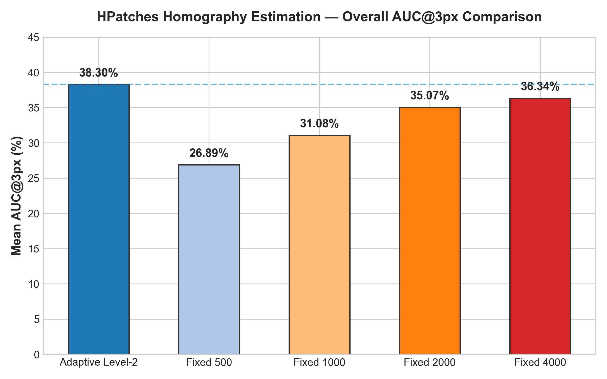
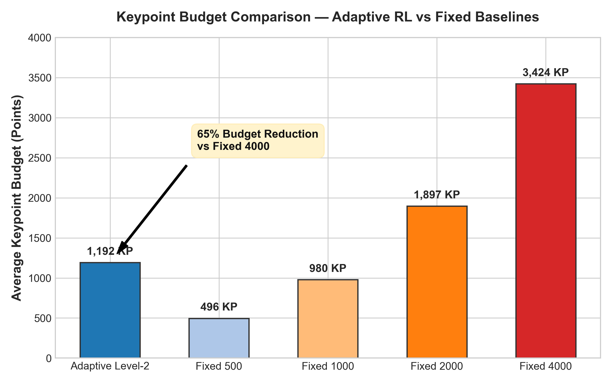
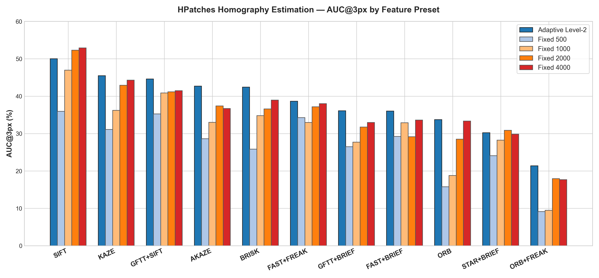
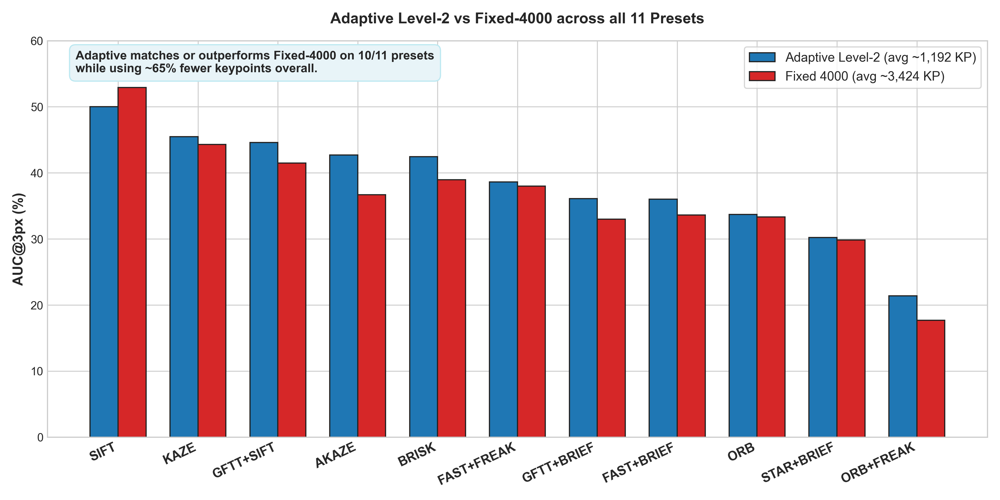
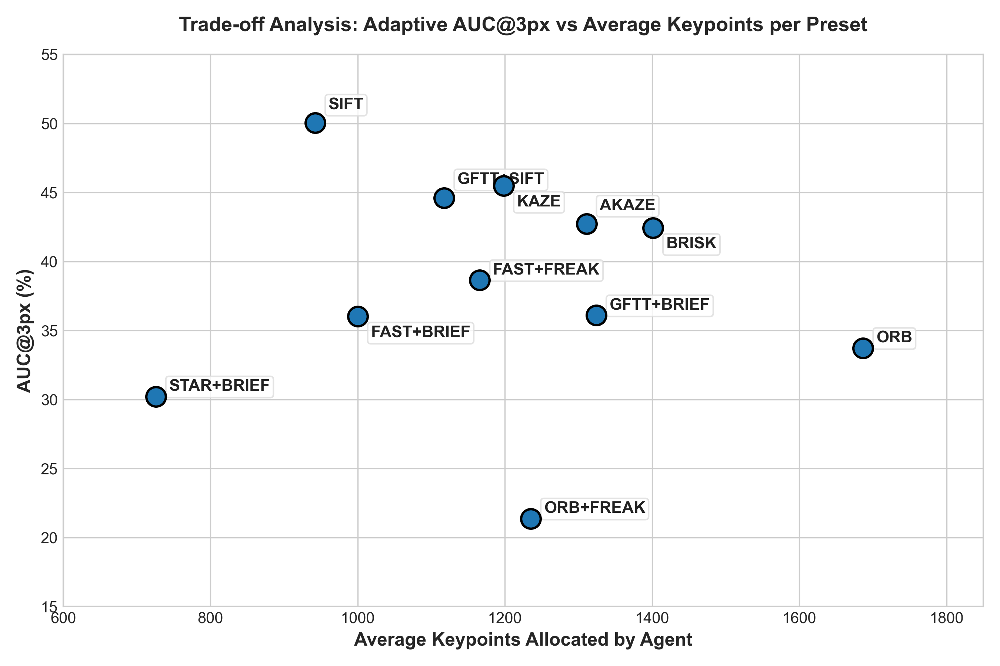
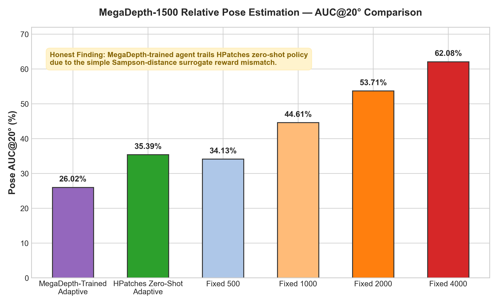

# Adaptive Feature Matching using Hierarchical Reinforcement Learning (AFM-RL)
## Final Project Report & Comprehensive Experimental Evaluation

---

## 1. What Problem Are We Solving?

When computers look at two photos of the same scene or object taken from different viewpoints or under different lighting, they need to identify which parts of the photos correspond to each other. This process is called **image feature matching**.

To do this, computer vision algorithms detect distinctive local spots on an image called **keypoints** (such as corners or distinctive textures). The computer then computes a numerical summary for the region around each keypoint (called a **feature descriptor**) and matches corresponding points between the two images.

```
Photo 1 [Detect Keypoints] ─────┐
                                 ├─► [Match Correspondences] ──► [Estimate Geometry]
Photo 2 [Detect Keypoints] ─────┘
```

### The Keypoint Budget Problem:
- **Using too few keypoints (e.g., 500):** If an image pair is challenging (for example, with large perspective shifts or low contrast), 500 keypoints might not produce enough correct matches, causing geometric estimation to fail.
- **Using more keypoints (e.g., 4000):** Using more keypoints increases the computational workload because more features must be processed and more descriptor comparisons may be required. In this study, we measured keypoint usage rather than performing a controlled wall-clock runtime benchmark. Therefore, our claim is about reduced keypoint workload, not a measured percentage reduction in execution time.
- **The Core Issue:** Fixed keypoint budgets lack scene adaptability: the same budget is used for every image pair, even though different pairs may require different numbers of useful features. On simple pairs, a large fixed budget may allocate more features than necessary. On difficult pairs, a small fixed budget may not provide enough useful correspondences.

---

## 2. Our Basic Idea

Instead of forcing every image pair to use the exact same fixed number of keypoints, we use **Reinforcement Learning (RL)** to dynamically decide how many keypoints are needed for each specific image pair.

The complete AFM-RL architecture is organized into two hierarchical levels:
1. **Level 1 (Pipeline Selection):** Selects which feature detector and descriptor algorithm to use (e.g., SIFT, ORB, AKAZE).
2. **Level 2 (Keypoint Budget Allocation):** Dynamically adjusts the keypoint budget (+500, +1000, -500, or STOP) until the alignment is accurate and efficient.

In this project evaluation, we focus on the **Level-2 adaptive keypoint allocation agent**, evaluating its performance across 11 different feature matching pipelines.

---

## 3. What Does the RL Agent Actually Do?

The RL agent interacts with each image pair sequentially:

```
┌─────────────────────────────────────────────────────────────────────────┐
│                           The RL Decision Loop                          │
│                                                                         │
│  1. OBSERVE: Read image difficulty & current matching state             │
│  2. DECIDE:  Select an action (+500, +1000, -500 keypoints, or STOP)    │
│  3. MEASURE: Extract features, match them, and evaluate alignment       │
│  4. REWARD:  Gain reward for accuracy, penalized for keypoint cost      │
│  5. REPEAT:  Continue adjusting until the agent chooses to STOP         │
└─────────────────────────────────────────────────────────────────────────┘
```

1. **Initial Step:** The agent starts with a default budget of 500 keypoints and extracts initial matches.
2. **Observation:** It receives a 31-dimensional observation vector describing image properties (contrast, brightness change, edge density), the active feature pipeline (1-hot encoded), and current matching statistics (number of matches, inlier ratio, recent accuracy change).
3. **Action:** The agent chooses one of four discrete actions:
   - Add 500 keypoints (`+500`)
   - Add 1,000 keypoints (`+1000`)
   - Remove 500 keypoints (`-500`)
   - Stop immediately (`STOP`)
4. **Utility & Reward:** The agent receives a reward based on matching accuracy minus a keypoint cost penalty ($\lambda = 0.1 \times \text{keypoints} / 4000$). This encourages the agent to stop once additional keypoints no longer provide meaningful improvements in matching accuracy.

---

## 4. Why Compare Against Fixed Budgets?

To evaluate whether the RL agent makes effective decisions, we test it against static fixed budgets on the exact same benchmark pairs:
- **Fixed 500:** Fast and lightweight, but prone to failing on difficult pairs.
- **Fixed 1000:** A common default budget in feature matching applications.
- **Fixed 2000:** A higher budget commonly used in benchmarks.
- **Fixed 4000:** A large budget ceiling that maximizes coverage at the expense of higher feature processing workload.

*Note on Fixed-4000 keypoint average:* Fixed-4000 means the system requests up to 4,000 keypoints. The actual average was 3,424.4 because some images did not contain enough usable feature points to reach the 4,000-point ceiling.

If our adaptive agent can reach or exceed the accuracy of Fixed 2000 or Fixed 4000 while using far fewer keypoints on average, it **provides strong empirical evidence that adaptive budget allocation can outperform fixed-budget strategies on this benchmark.**

---

## 5. How We Evaluated the System

We evaluated the system on the standard **HPatches benchmark** using the **RIPE evaluation protocol**:
- **Dataset Sequences:** 116 total sequences in HPatches.
- **Evaluation Split:** The official held-out **Test Split** (17 sequences = 85 image pairs).
- **Pair Diversity:**
  - **8 Illumination Sequences (40 image pairs):** Changes in scene illumination and exposure.
  - **9 Viewpoint Sequences (45 image pairs):** Changes in camera angle and perspective.
- **Strict Isolation:** The test split was kept strictly isolated from model training and validation.
- **Total Evaluations:** 85 pairs $\times$ 11 presets $\times$ 5 methods = **4,675 individual evaluations**.

---

## 6. What Does AUC Mean?

AUC (Area Under the Curve) summarizes how accurately the estimated homography performs across a range of error thresholds.

For each image pair, we calculate the corner reprojection error between the estimated homography and the ground-truth homography. We then build a cumulative curve showing how many pairs achieve an error below each threshold.

AUC summarizes the area under this curve up to the selected threshold. Therefore, AUC is different from Success Rate: Success Rate only checks whether the final error is below one specific cutoff, while AUC considers performance across all thresholds up to that cutoff.

Higher AUC means the method produces more consistently accurate geometric matches.

- **AUC@1px:** Summarizes performance from 0 to 1 pixel of error.
- **AUC@3px:** Summarizes performance from 0 to 3 pixels of error.
- **AUC@5px:** Summarizes performance from 0 to 5 pixels of error.

**Success@1px, Success@3px, and Success@5px** are the corresponding percentages of image pairs whose final corner error is below the selected threshold.

---

## 7. HPatches Final Results

Below are the verified experimental results across all 85 held-out test pairs and all 11 feature matching presets:

### Overall Benchmark Comparison Table

| Method | Avg Keypoints | Avg Steps | AUC@1px (%) | AUC@3px (%) | AUC@5px (%) | Success@1px (%) | Success@3px (%) | Success@5px (%) |
| :--- | :---: | :---: | :---: | :---: | :---: | :---: | :---: | :---: |
| **Adaptive Level-2 (RL)** | **1,191.7** | **3.80** | **14.24%** | **38.30%** | **51.97%** | **31.55%** | **64.39%** | **78.18%** |
| Fixed 500 | 495.6 | 1.00 | 10.54% | 26.89% | 35.51% | 22.57% | 42.67% | 54.01% |
| Fixed 1000 | 979.5 | 1.00 | 13.54% | 31.08% | 40.64% | 26.74% | 48.88% | 60.11% |
| Fixed 2000 | 1,897.0 | 1.00 | 14.73% | 35.07% | 45.74% | 29.73% | 56.26% | 66.20% |
| Fixed 4000 | 3,424.4 | 1.00 | 15.76% | 36.34% | 47.09% | 31.55% | 56.79% | 68.66% |

---

## 8. HPatches Comparison: Adaptive vs Fixed Budgets


*Figure 1: Overall AUC@3px comparison across all 5 evaluated methods on the HPatches test split.*


*Figure 2: Keypoint budget comparison showing that Adaptive Level-2 uses ~65% fewer keypoints on average than Fixed 4000.*

### Detailed Numerical Comparisons:

1. **Adaptive vs Fixed 500:**
   - **AUC@3px:** **+11.41 percentage points (pp)** (38.30% vs 26.89%)
   - **AUC@5px:** **+16.46 percentage points (pp)** (51.97% vs 35.51%)
   - **Success@3px:** **+21.72 percentage points (pp)** (64.39% vs 42.67%)
   - *Observation:* Adaptive Level-2 substantially improves over Fixed 500 by allocating more points when 500 points are insufficient.

2. **Adaptive vs Fixed 1000:**
   - **AUC@3px:** **+7.22 percentage points (pp)** (38.30% vs 31.08%)
   - **AUC@5px:** **+11.33 percentage points (pp)** (51.97% vs 40.64%)
   - *Observation:* While using an average of 1,191.7 keypoints (compared to 979.5 for Fixed 1000), Adaptive Level-2 achieves higher AUC by dynamically distributing points where needed.

3. **Adaptive vs Fixed 2000:**
   - **AUC@3px:** **+3.23 percentage points (pp)** (38.30% vs 35.07%)
   - **AUC@5px:** **+6.23 percentage points (pp)** (51.97% vs 45.74%)
   - **Keypoint Difference:** **705.3 fewer keypoints** on average (1,191.7 vs 1,897.0 KP, a ~37% reduction in keypoint count).

4. **Adaptive vs Fixed 4000:**
   - **AUC@3px:** **+1.96 percentage points (pp)** (38.30% vs 36.34%)
   - **AUC@5px:** **+4.88 percentage points (pp)** (51.97% vs 47.09%)
   - **Keypoint Difference:** **2,232.7 fewer keypoints** on average (1,191.7 vs 3,424.4 KP, a **65.2% reduction in keypoint count**).
   - *Multi-threshold nuance:* Adaptive achieves the highest overall AUC at the 3px and 5px thresholds, while Fixed-4000 is slightly better at the strictest 1px threshold (15.76% vs 14.24%).

---

## 9. Best and Worst Presets

### SIFT (Best-Performing Preset)
SIFT was the strongest Adaptive Level-2 preset in this experiment. It achieved the highest Adaptive AUC@3 and AUC@5 values among the 11 presets: **50.03% AUC@3** and **64.41% AUC@5**. It used an average of **942 keypoints** (2.94 steps).

This shows that SIFT worked particularly well with the adaptive keypoint strategy on the HPatches benchmark.

### ORB+FREAK (Weakest-Performing Preset)
ORB+FREAK produced the lowest measured AUC values among the 11 presets in our experiment: **21.37% AUC@3** and **33.69% AUC@5**. It used an average of **1,235 keypoints** (4.01 steps).

This indicates that this particular hybrid pipeline was the weakest-performing preset on this benchmark. The experiment measures this empirical outcome, but it does not establish a single causal reason for the lower performance.

---

## 10. Important Per-Preset Comparison

Below is the verified AUC@3px comparison across all 11 presets:

| Preset | Adaptive AUC@3 (%) | Adaptive KP | Fixed 500 AUC@3 (%) | Fixed 1000 AUC@3 (%) | Fixed 2000 AUC@3 (%) | Fixed 4000 AUC@3 (%) | Gain vs Fixed 500 (pp) | Gap vs Fixed 4000 (pp) |
| :--- | :---: | :---: | :---: | :---: | :---: | :---: | :---: | :---: |
| **SIFT** | **50.03** | 942 | 35.96 | 46.95 | 52.31 | 52.91 | **+14.07 pp** | -2.88 pp |
| **KAZE** | **45.49** | 1,198 | 31.12 | 36.20 | 42.91 | 44.30 | **+14.37 pp** | **+1.19 pp** |
| **GFTT+SIFT** | **44.61** | 1,118 | 35.25 | 40.87 | 41.15 | 41.49 | **+9.36 pp** | **+3.12 pp** |
| **AKAZE** | **42.71** | 1,311 | 28.64 | 33.00 | 37.38 | 36.69 | **+14.07 pp** | **+6.02 pp** |
| **BRISK** | **42.43** | 1,401 | 25.84 | 34.81 | 36.60 | 38.96 | **+16.59 pp** | **+3.47 pp** |
| **FAST+FREAK**| **38.64** | 1,166 | 34.28 | 32.97 | 37.16 | 37.99 | **+4.36 pp** | **+0.65 pp** |
| **GFTT+BRIEF**| **36.09** | 1,324 | 26.47 | 27.72 | 31.75 | 32.98 | **+9.62 pp** | **+3.11 pp** |
| **FAST+BRIEF**| **36.01** | 1,000 | 29.25 | 32.88 | 29.16 | 33.60 | **+6.76 pp** | **+2.41 pp** |
| **ORB** | **33.72** | 1,687 | 15.76 | 18.77 | 28.51 | 33.34 | **+17.96 pp** | **+0.38 pp** |
| **STAR+BRIEF**| **30.21** | 726 | 24.09 | 28.25 | 30.88 | 29.83 | **+6.12 pp** | **+0.38 pp** |
| **ORB+FREAK** | **21.37** | 1,235 | 9.15 | 9.48 | 17.94 | 17.69 | **+12.22 pp** | **+3.68 pp** |


*Figure 3: AUC@3px comparison across all 11 feature matching presets.*


*Figure 4: Direct comparison of Adaptive Level-2 vs Fixed 4000 per preset.*

### Accuracy vs Keypoint Budget (Scatter Plot Interpretation)


*Figure 5: Adaptive AUC@3px vs average keypoints allocated across presets.*

The scatter plot shows that using more keypoints does not automatically produce higher matching accuracy. For example, SIFT achieves 50.03% AUC@3 with about 942 average keypoints, while ORB uses about 1,687 keypoints but achieves 33.72% AUC@3.

This suggests that the feature pipeline is important in addition to the number of keypoints. Different feature pipelines have different performance levels even when their keypoint budgets are similar.

The RL agent therefore operates at different keypoint budgets for different feature pipelines rather than forcing every pipeline to use the same number of keypoints.

---

## 11. Does the RL Agent Actually Help?

**Yes.** On the HPatches test benchmark, Adaptive Level-2 achieved the highest overall AUC@3 and AUC@5 among the evaluated methods.

Adaptive achieved **38.30% AUC@3** compared with **36.34% for Fixed-4000**, while using **1,191.7 rather than 3,424.4 average keypoints** (about 65% fewer keypoints on average).

Supporting empirical facts:
1. **Outperforms Fixed 500 on all 11 presets:** Gains range from +4.36 pp to +17.96 pp at AUC@3px.
2. **Outperforms Fixed-4000 on 10 of the 11 feature presets:** The only exception is SIFT, where Fixed-4000 achieves 52.91% compared with 50.03% for Adaptive.
3. **Threshold Nuance:** At the strictest AUC@1px threshold, Fixed-4000 was slightly higher than Adaptive (15.76% vs 14.24%).
4. **Behavior on Different Scene Types:** On the held-out HPatches test set, the agent tended to use fewer keypoints for illumination-change pairs and more keypoints for viewpoint-change pairs. Illumination pairs averaged **934.0 keypoints** and **2.36 steps**, while viewpoint pairs averaged **1,420.7 keypoints** and **5.08 steps**.

---

## 12. The MegaDepth Experiment

To evaluate whether the Level-2 RL concept could be applied to outdoor 3D scenes, we evaluated on **MegaDepth-1500**:
- **Task:** 3D relative camera pose estimation (estimating relative rotation $R$ and translation $T$).
- **Metric:** Angular pose error AUC at 5°, 10°, and 20° thresholds (RIPE protocol).
- **Dataset Split:** 1,050 train pairs, 225 validation pairs, 225 held-out test pairs.

### MegaDepth Training Setup
The MegaDepth experiment used a target training schedule of 170,528 timesteps, matching the verified HPatches training horizon. Validation was performed periodically on the 225-pair validation split. The best validation checkpoint was at **110,416 timesteps**, with a mean validation reward of **0.2030**. This best validation model was selected for the final held-out test evaluation.

### Measured MegaDepth Test Results (225 Held-Out Pairs):

| Method | Pose AUC@5° (%) | Pose AUC@10° (%) | Pose AUC@20° (%) |
| :--- | :---: | :---: | :---: |
| **MegaDepth-Trained Adaptive** | **8.94%** | **17.16%** | **26.02%** |
| **HPatches-Trained Zero-Shot Adaptive** | **11.87%** | **22.09%** | **35.39%** |
| Fixed 500 Baseline | — | — | 34.13% |
| Fixed 1000 Baseline | — | — | 44.61% |
| Fixed 2000 Baseline | — | — | 53.71% |
| Fixed 4000 Baseline | — | — | 62.08% |


*Figure 6: MegaDepth-1500 relative camera pose estimation AUC@20° comparison.*

---

## 13. What Happened on MegaDepth?

### What we observed
The MegaDepth-trained Adaptive agent achieved **26.02% AUC@20°**, compared with **35.39%** for the HPatches-trained zero-shot Adaptive agent. The MegaDepth-trained agent also used an average of about **529 keypoints**, showing a relatively conservative keypoint allocation.

### Possible explanation
One possible explanation is that the Sampson-distance surrogate reward used during MegaDepth training was not sufficiently aligned with the final relative-pose objective. The surrogate reward and the final pose metric measure related but different aspects of geometric consistency.

The conservative keypoint allocation suggests that the reward may have encouraged the policy to stop before additional keypoints provided enough useful correspondences for the final pose-estimation pipeline.

---

## 14. What Did We Learn?

- **Fixed keypoint budgets lack adaptability:** The same budget is used for every image pair, even though different pairs may require different numbers of useful features.
- **Adaptive allocation improved HPatches results:** On HPatches, Adaptive Level-2 achieved the highest overall AUC@3 and AUC@5 while using about 65% fewer keypoints than Fixed-4000.
- **SIFT was the strongest preset:** Achieved 50.03% AUC@3 with an average of 942 keypoints.
- **ORB+FREAK was the weakest preset:** Produced the lowest measured AUC on this benchmark.
- **Reward formulation is critical for task transfer:** A surrogate reward that is easy to compute may not align directly with 3D pose objectives.

---

## 15. Final Conclusion

Reinforcement learning provides a practical framework for dynamic keypoint budget allocation in feature matching. On the HPatches benchmark, our Level-2 adaptive agent achieved **38.30% AUC@3px**, outperforming the Fixed-4000 baseline (**36.34%**) while using about **65% fewer keypoints on average** (1,191.7 vs 3,424.4 keypoints).

---

## 16. Limitations

1. **Level 2 Only:** This evaluation focuses on Level 2 (budget allocation). Level 1 (pipeline selection) was not evaluated end-to-end in this study.
2. **MegaDepth Reward Surrogate:** MegaDepth training used an epipolar surrogate reward rather than direct 5-point angular error optimization.
3. **Keypoint Workload vs Physical Runtime:** Computational efficiency was evaluated using keypoint counts rather than a controlled wall-clock runtime benchmark in milliseconds.
4. **Aachen Out of Scope:** Visual localization on Aachen Day-Night was not evaluated in this project phase.

---

## 17. Future Work

1. **Level 1 + Level 2 Integration:** Train Level 1 pipeline selection on top of the Level 2 budget policy.
2. **Direct Pose Reward for MegaDepth:** Integrate camera intrinsics directly into the step reward to optimize relative pose error.
3. **Aachen Day-Night Evaluation:** Evaluate visual localization under day-night and seasonal conditions.
4. **Hardware Benchmarking:** Perform physical runtime and latency profiling on embedded hardware platforms.
